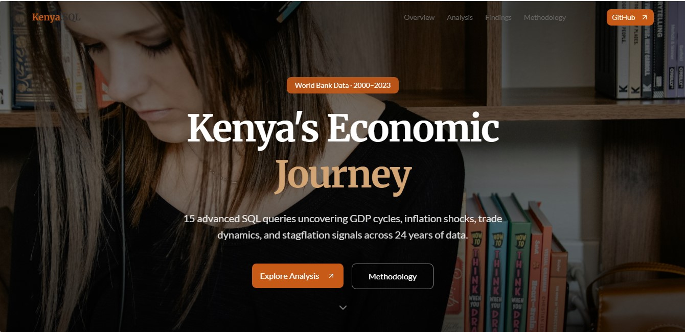
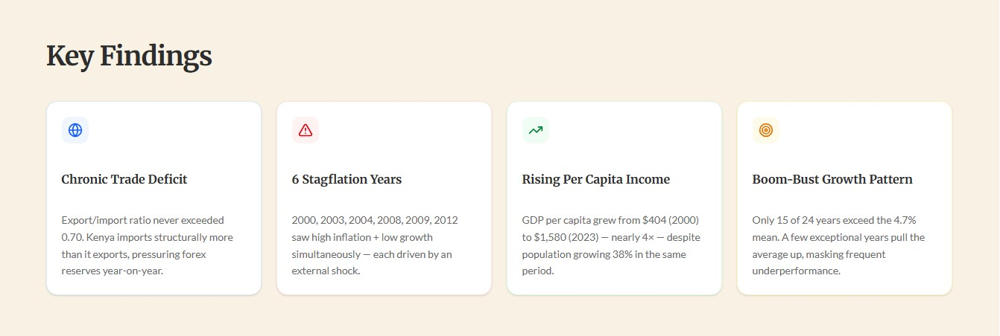
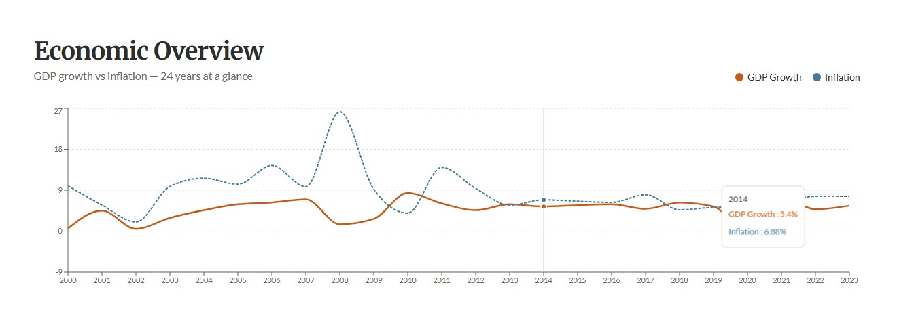
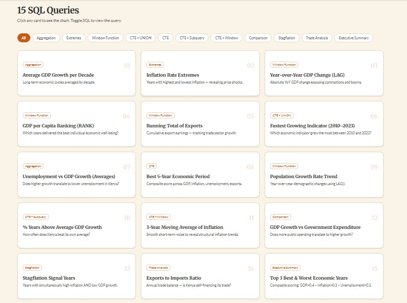
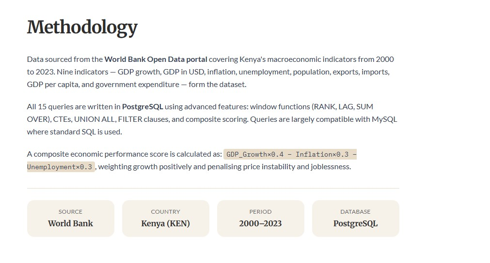

# 🇰🇪 Kenya's Economic Journey — SQL Analysis Portfolio

[](https://react.dev)
[](https://www.typescriptlang.org)
[](https://www.postgresql.org)
[](https://recharts.org)
[](https://vitejs.dev)
[](https://github.com/MIKECHITI)

> An interactive data storytelling portfolio built with React + TypeScript, visualising **15 advanced SQL queries** on Kenya's macroeconomic indicators (2000–2023) sourced from the World Bank.

**[🔗 Live Site](#)** · **[📊 SQL Analysis Repo](https://github.com/MIKECHITI/kenya-economic-sql-analysis)** · **[👤 Portfolio](https://mwombemichael.vercel.app)**

---

## 📸 Screenshots

### Hero — Landing Section


### Key Findings


### Economic Overview Chart


### 15 SQL Queries Grid


### Methodology Section


---

## ✨ Features

- **Interactive query cards** — click any of the 15 cards to expand a live Recharts visualisation
- **SQL toggle** — reveal the formatted PostgreSQL query for each analysis inline
- **Category filter** — filter queries by type: Aggregation, Window Function, CTE, Stagflation, Trade Analysis, Executive Summary
- **Economic Overview chart** — full-width dual-line chart of GDP growth vs inflation across 24 years
- **Key Findings strip** — 4 data-driven insight cards computed live from the dataset
- **Dark / Light mode** — switchable via the navbar toggle, persisted to localStorage
- **Sticky navbar** — frosted glass on scroll with smooth section anchors
- **Fully responsive** — mobile-first layout, hamburger menu on small screens
- **Framer Motion** — staggered entrance animations and smooth card expand/collapse

---

## 📊 The Analysis

15 SQL queries covering the full spectrum of advanced PostgreSQL techniques:

| # | Query | Technique |
|---|---|---|
| 01 | Average GDP Growth per Decade | `GROUP BY`, `AVG`, `FLOOR` |
| 02 | Inflation Rate Extremes | `ORDER BY`, `LIMIT` |
| 03 | Year-over-Year GDP Change | `LAG()` window function |
| 04 | GDP per Capita Ranking | `RANK()` window function |
| 05 | Running Total of Exports | `SUM() OVER` window function |
| 06 | Fastest Growing Indicator (2010–2023) | CTE + `UNION ALL` + `FILTER` |
| 07 | Unemployment vs GDP Growth | `AVG` aggregation |
| 08 | Best 5-Year Economic Period | CTE + composite scoring |
| 09 | Population Growth Rate Trend | `LAG()` + percentage change |
| 10 | % Years Above Average GDP Growth | CTE + subquery + `CASE` |
| 11 | 3-Year Moving Average of Inflation | `AVG() OVER ROWS BETWEEN` |
| 12 | GDP Growth vs Government Expenditure | Multi-column comparison |
| 13 | Stagflation Signal Years | CTE + cross-join filter |
| 14 | Exports to Imports Ratio | `CASE WHEN` ratio |
| 15 | Top 3 Best & Worst Economic Years | CTE + `UNION ALL` + composite score |

---

## 🔑 Key Findings

| Finding | Detail |
|---|---|
| 🌍 **Chronic Trade Deficit** | Export/import ratio never exceeded 0.70 across 24 years |
| ⚠️ **6 Stagflation Years** | 2000, 2003, 2004, 2008, 2009, 2012 — each driven by an external shock |
| 📈 **Rising Per Capita Income** | GDP per capita grew from $404 (2000) to $1,580 (2023) — nearly 4× |
| 🎯 **Boom-Bust Pattern** | Only 15 of 24 years exceed the 4.7% mean growth average |

---

## 🛠️ Tech Stack

| Layer | Technology |
|---|---|
| **Framework** | React 19 + TypeScript 5.6 |
| **Build Tool** | Vite 7 |
| **Styling** | Tailwind CSS v4 |
| **Charts** | Recharts 2.x |
| **Animations** | Framer Motion |
| **UI Components** | shadcn/ui + Radix UI |
| **Routing** | Wouter |
| **Database** | PostgreSQL (analysis) |
| **Fonts** | Merriweather + Lato + IBM Plex Mono |

---

## 📁 Project Structure

```
kenya-portfolio/
├── client/
│   └── src/
│       ├── pages/
│       │   └── Home.tsx          # Main page — all 15 queries, charts, sections
│       ├── contexts/
│       │   └── ThemeContext.tsx   # Dark/light mode
│       ├── components/ui/        # shadcn/ui components
│       └── index.css             # Tailwind + theme tokens
├── server/
│   └── index.ts                  # Express dev server
├── screenshots/                  # Portfolio screenshots
└── shared/
    └── const.ts
```

---

## 🚀 Running Locally

```bash
# Clone the repo
git clone https://github.com/MIKECHITI/kenya-economic-sql-analysis-portfolio.git
cd kenya-economic-sql-analysis-portfolio

# Install dependencies
npm install --legacy-peer-deps

# Start dev server
npm run dev
```

Open `http://localhost:3000`

---

## 🔗 Related

- **[SQL Analysis Repo](https://github.com/MIKECHITI/kenya-economic-sql-analysis)** — the full PostgreSQL query file, dataset CSV, and findings README
- **[Portfolio](https://mwombemichael.vercel.app)** — main portfolio site

---

## 👤 Author

**Michael Mwombe** — Data Analyst & Full-Stack Developer | Nairobi, Kenya 🇰🇪

[](https://github.com/MIKECHITI)
[](https://mwombemichael.vercel.app)
[](https://x.com/chiti_ke)

---

## 📄 License

MIT License — free to use and adapt with attribution.

---

<p align="center"><b>⭐ Star this repo if you found it useful!</b></p>
